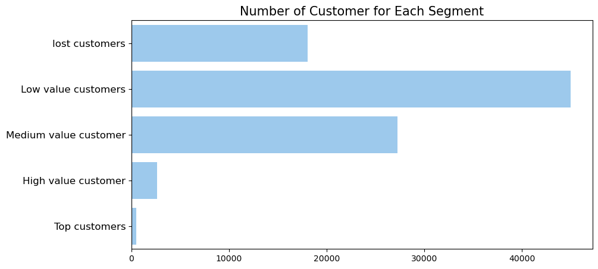

# Selected Projects in Data Science & Machine Learning

---

## Implement RFM Analysis and Sales Prediction on E-Comerce Dataset

To gain insights into customer behavior and improve sales, I utilized the RFM (Recency, Frequency, Monetary) analysis approach to segment customers based on their past purchasing behavior. In addition, I employed the LSTM model using TensorFlow to develop a robust sales prediction model.

  

[View code on GitHub repository](https://github.com/rfajri27/ds-test)

---

## Skin Cancer Segmentation

Skin cancer segmentation is a critical task in the diagnosis and treatment of skin cancer. In this project, I developed an automated method for accurately segmenting skin cancer images. Using the functional API in TensorFlow, I built a U-Net architecture model that effectively segmented the affected areas of skin. To evaluate the model's performance, I used the Intersection over Union (IoU) metric and the Dice coefficient, achieving impressive results that indicate the model's ability to accurately identify and segment skin cancer.

  

[View code on GitHub repository](https://github.com/rfajri27/skin-cancer-segmentation)

---

## Implement CI/CD on Machine Learning System
In this project, I applied the DevOps methodology which highlights speedy and efficient software development and deployment by implementing Continuous Integration and Delivery (CI/CD) practices. I established automated testing and data validation every time there was a modification in code or data, and deployed it on Heroku using FastAPI. Additionally, I utilized DVC to manage version control of data and model artifacts, ensuring that any changes made to them were tracked and easily reproducible.

     

[View code on GitHub repository](https://github.com/rfajri27/deploy-model-on-heroku)

---

## Question Similarity Check

Question similarity check is the automated task to detecting similarity between a pair of questions. In this project, I build a NLP model to create vector representations for each question and used cosine similarity to determine the similarity between these vectors.

  

---

## Deep NLP for Sentiment Analysis

Sentiment analysis is the process of analyzing digital text to determine if the emotional tone of the message is positive, negative, or neutral. For this project, I used PyTorch to develop a classifier and fine-tuned an IndoBERT model. I used this model to analyze more than 50K student feedback and predict their sentiment, allowing me to identify common complaints from students.

   
